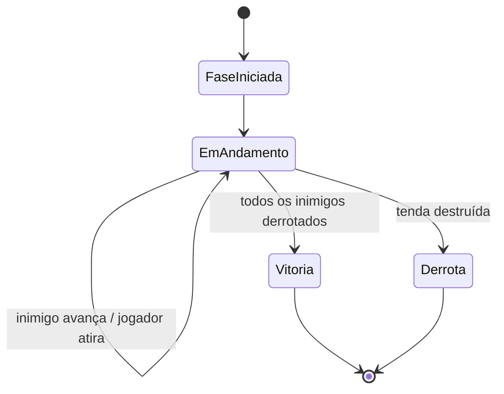
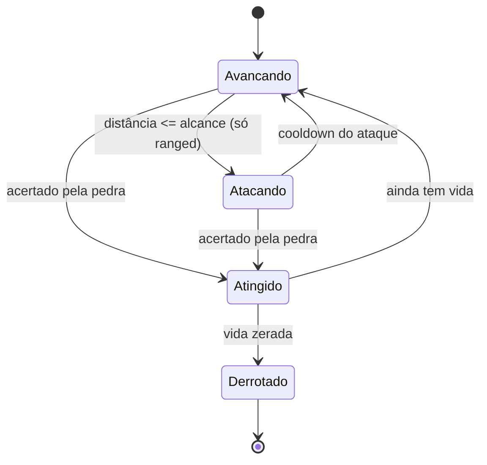
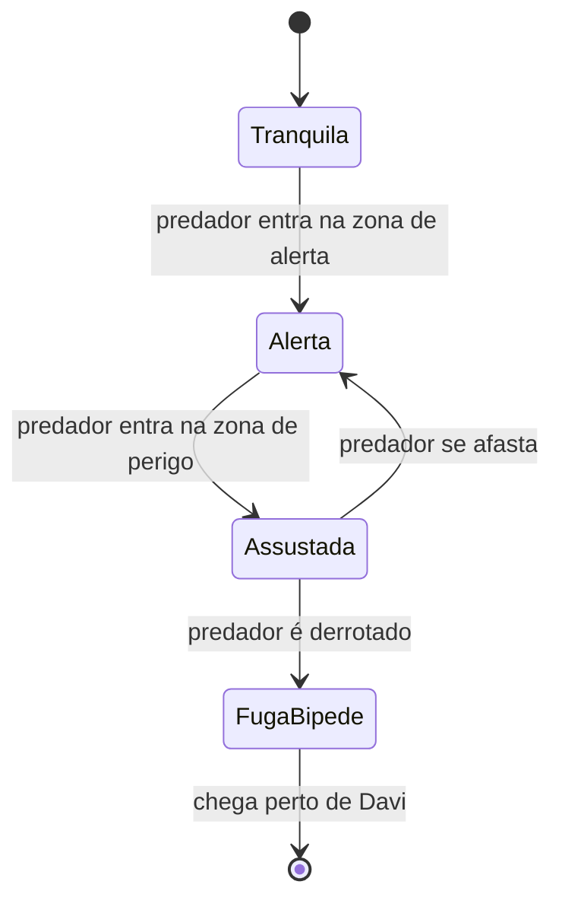

# Spec de Mecânica — Davi vs Filisteus
*Game Design Document (GDD) — complementa o PRD*

> Diferença em relação ao PRD: aqui o objetivo é documentar **regras e números exatos** o suficiente pra implementar sem precisar decidir nada "no meio do código". Todo valor numérico abaixo é uma **sugestão de ponto de partida** — ajuste jogando e testando. O que importa é que esteja documentado, não que esteja certo de primeira.
>
> Convenção de unidade: distâncias em **% da largura da tela** (não pixels fixos), pra funcionar igual em qualquer resolução de celular. Se a tela tem 960px de largura lógica, "10%" = 96px.

---

## 1. Loop de jogo (visão geral)



Cada fase tem uma lista fixa de inimigos (ex: Fase 1 = só o Leão; Fase 3 = vários Soldados + eventualmente o Golias). Todos "nascem" no lado direito da tela e avançam até a tenda, no lado esquerdo, onde Davi está posicionado entre os dois.

---

## 2. Sistema de estilingue

Valores já testados e validados no protótipo anterior — reaproveitar como ponto de partida:

| Parâmetro | Valor sugerido | Função |
|---|---|---|
| `MAX_PULL_RADIUS` | 120px (ou ~12% da largura da tela) | Raio máximo que o jogador pode puxar a pedra |
| `MAX_PULL_DOWN` | 70px (~7% da largura) | Limite vertical pra não enterrar a pedra no piso/colisores |
| `LAUNCH_MULTIPLIER` | 0.18 | Converte a distância puxada em velocidade de lançamento (preview da mira) |
| `GRAVITY_PER_FRAME` | 0.5 | Gravidade aproximada usada só pro desenho da linha de mira |
| Stiffness do constraint real (Matter.js) | 0.05 | Define a "elasticidade" do lançamento físico de verdade |
| Sensor durante o arrasto | `isSensor = true` | Evita a pedra colidir com cenário enquanto está sendo puxada |

**Dano da pedra:** cada acerto derrota um inimigo "fraco" (Soldado) em 1 hit. Inimigos maiores precisam de mais de um acerto (ver tabela da seção 3).

---

## 3. Sistema de avanço de inimigos

### Máquina de estados (por inimigo)



### Valores por tipo de inimigo

| Inimigo | Velocidade de avanço | Vida (nº de acertos) | Tipo de ataque | Alcance de ataque | Observação |
|---|---|---|---|---|---|
| Leão | 4%/s | 2 | Corpo a corpo (ao alcançar a tenda) | — | Ameaçador, rápido |
| Urso | 2.5%/s | 2 | Corpo a corpo (cômico) | — | Mais lento, mais cômico |
| Soldado Lanceiro | 3%/s | 1 | Lança (à distância) | 35% da tela | Precisa se aproximar bastante |
| Soldado Arqueiro | 2%/s (anda menos, prioriza atirar) | 1 | Flecha (à distância) | 60% da tela | Maior alcance do elenco comum |
| Soldado Escudeiro | 1.5%/s | 1 | Nenhum — só bloqueia | — | Não ataca; ver efeito sobre o Golias abaixo |
| Golias | 1%/s (normal) → 2.5%/s (após Escudeiro derrotado) | 4 | Lança (à distância, alcance 45%) → Espada (corpo a corpo, alcance <10%) | 45% / <10% | Chefão; troca de arma por distância |

**Efeito do Escudeiro sobre o Golias:** enquanto o Escudeiro relacionado a essa fase estiver vivo, a velocidade do Golias fica fixa no valor "normal" (1%/s), independente de qualquer outro fator. No instante em que o Escudeiro é derrotado, a velocidade do Golias passa a 2,5%/s. Implementação sugerida: uma flag booleana `escudeiroVivo` que a lógica do Golias consulta a cada frame.

---

## 4. Sistema de ataque à distância (projétil inimigo)

| Projétil | Velocidade | Dano à tenda | Trajetória |
|---|---|---|---|
| Lança (Soldado Lanceiro) | 400px/s | 1 estágio | Parabólica (gravidade leve) |
| Flecha (Soldado Arqueiro) | 600px/s | 1 estágio | Quase reta (gravidade mínima) |
| Lança (Golias) | 450px/s | 2 estágios | Parabólica |

**Resolução da pergunta pendente do PRD — "todo projétil que passa acerta a tenda?"**
Sugestão para o MVP: **sim, automaticamente** — Davi fica numa posição fixa entre os inimigos e a tenda, e não se move/desvia. A defesa do jogador é **indireta**: derrotar o inimigo antes que ele consiga atacar. Isso simplifica bastante o controle (continua sendo "um dedo só", sem precisar de um segundo gesto de "mover Davi"). Se depois do MVP você quiser adicionar uma camada de habilidade extra, mover o Davi pra desviar é uma ótima feature de v2 — mas eu recomendo **não** colocar isso na v1, pra não competir com o aprendizado de física que já é o foco principal.

---

## 5. Sistema de vida — Tenda

| Estágio | Vida restante | Visual |
|---|---|---|
| Intacta | 100% | Tenda normal |
| Danificada | 50% | Tenda com rasgos/remendos visíveis, levemente caída |
| Destruída | 0% | Tenda caída/desmontada → dispara tela de derrota |

- Cada acerto de projétil reduz 1 estágio (lança do Golias reduz 2 de uma vez — ver seção 4)
- 2 acertos "normais" = derrota (3 estágios, 2 transições) — ajustável conforme o playtesting indicar se está fácil ou difícil demais
- Recomendo expor esse número como constante (`TENDA_VIDA_MAXIMA = 2`, em "transições", não em "estágios visuais") pra ser fácil de rebalancear depois

---

## 6. Sistema de Ovelhas

### Máquina de estados (por ovelha)



### Zonas de distância (relativas à posição da ovelha em relação ao predador mais próximo)

| Zona | Distância do predador | Estado |
|---|---|---|
| Segura | > 60% da tela | Tranquila |
| Alerta | entre 30% e 60% | Alerta/Desconfiada |
| Perigo | < 30% | Assustada |

- Ao predador ser derrotado: a ovelha entra em `FugaBipede` (vira bípede) e corre em linha reta até a posição de Davi, numa velocidade alta (sugestão: 6%/s — mais rápida que qualquer inimigo, efeito cômico de "sumiu da tela")
- Esse sistema é só visual/narrativo — não afeta vitória/derrota diretamente

---

## 7. Sistema de progressão do personagem

| Parâmetro | Valor sugerido |
|---|---|
| XP por fase concluída | 100 XP |
| XP necessário pro próximo nível | 100 × nível atual (cresce linearmente) |
| Benefício por nível | +1 pedra disponível por fase, +10% de dano (reduz nº de acertos necessários a cada 2-3 níveis) |

> Essa seção é a que eu sugiro deixar mais aberta pra ajustar depois — progressão costuma precisar de bastante tentativa e erro pra "sentir" bem. Os valores acima são só pra você ter algo programável desde já, sem travar esperando a fórmula perfeita.

---

## 8. Tabela-resumo de constantes (referência rápida pro código)

```
// Estilingue
MAX_PULL_RADIUS = 120
MAX_PULL_DOWN = 70
LAUNCH_MULTIPLIER = 0.18
GRAVITY_PER_FRAME = 0.5
SLINGSHOT_STIFFNESS = 0.05

// Velocidade de avanço (% da largura da tela / segundo)
SPEED_LEAO = 0.04
SPEED_URSO = 0.025
SPEED_LANCEIRO = 0.03
SPEED_ARQUEIRO = 0.02
SPEED_ESCUDEIRO = 0.015
SPEED_GOLIAS_NORMAL = 0.01
SPEED_GOLIAS_SEM_ESCUDEIRO = 0.025

// Vida dos inimigos (nº de acertos)
VIDA_LEAO = 2
VIDA_URSO = 2
VIDA_LANCEIRO = 1
VIDA_ARQUEIRO = 1
VIDA_ESCUDEIRO = 1
VIDA_GOLIAS = 4

// Alcance de ataque à distância (% da largura da tela)
ALCANCE_LANCEIRO = 0.35
ALCANCE_ARQUEIRO = 0.60
ALCANCE_GOLIAS_LANCA = 0.45
ALCANCE_GOLIAS_ESPADA = 0.10

// Tenda
TENDA_VIDA_MAXIMA = 2  // transições até destruição

// Ovelhas
OVELHA_ZONA_SEGURA = 0.60
OVELHA_ZONA_ALERTA = 0.30
OVELHA_VELOCIDADE_FUGA = 0.06

// Progressão
XP_POR_FASE = 100
```

---

## 9. O que ficou fora desta spec (de propósito)

- Valores de física do Matter.js além do estilingue (fricção, restituição dos personagens) — definir durante a implementação, testando caso a caso
- Layout exato de cada fase (quantos inimigos, em que ordem aparecem) — fica pra um documento de "design de fase" futuro, fase por fase
- Balanceamento fino (esses números vão quase certamente mudar depois que você jogar) — esta spec é o ponto de partida, não a palavra final
